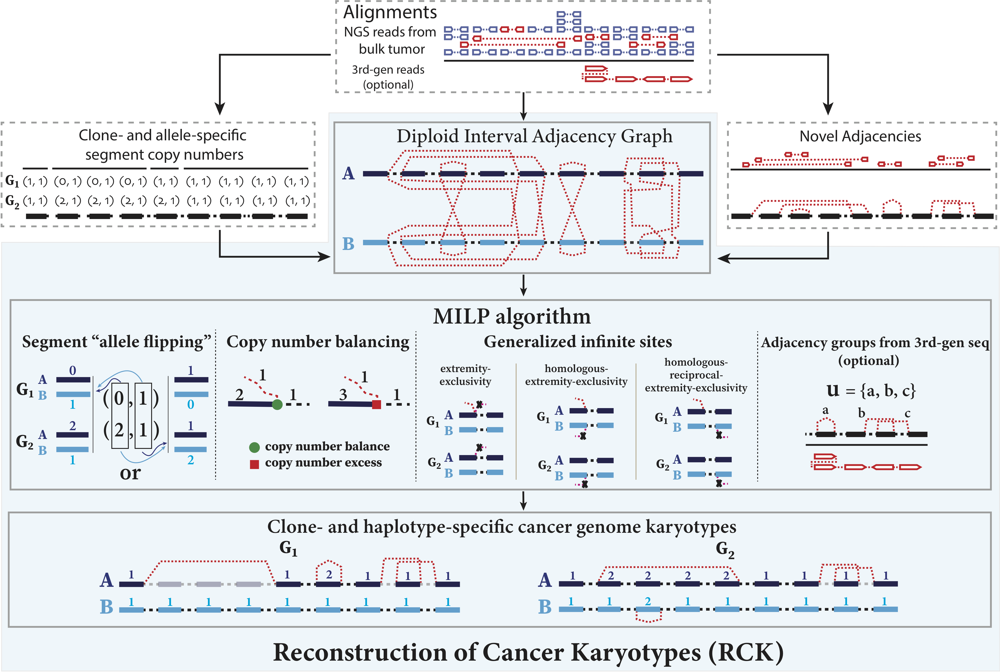

# RCK <br/> <sub>Reconstruction of clone- and haplotype-specific Cancer Karyotypes</sub>

[](https://raw.githubusercontent.com/hyperium/hyper/master/LICENSE)
[](https://www.python.org/downloads/)
[](https://travis-ci.com/aganezov/RCK)


**RCK** - is a method for **R**econstruction of clone- and haplotype-specific **C**ancer **K**aryotypes from tumor mixtures, distributed both as a standalone software package and as a Python library  under the MIT licence.

RCK has been initially designed and developed by Sergey Aganezov in the group of prof. Ben Raphael at Princeton University ([group site](http://compbio.cs.brown.edu/)).
Current development of RCK is continued by Sergey Aganezov in the group of prof. Michael Schatz at Johns Hopkins University ([group site](http://schatz-lab.org/)).

The full description of the algorithm and its application on published cancer datasets are described in:

````
````

### Contents:
1. [Algorithm overview](#algorithm-overview)
2. [Installation](#installation)
3. [Input preprocessing](#input-preprocessing)
    1. [Novel Adjacencies](#novel-adjacencies)
    2. [Segment copy numbers](#segment-copy-numbers) 
4. [Running RCK](#running-rck)
5. [Results](#results)
6. [Citation](#citation)
7. [Issues](#issues)

### Algorithm Overview



RCK infers clone- and haplotype-speicifc cancer genome karyotypes from tumor mixtures.

RCK assumes that:
* the reference human genome is diploid (except for sex chromosomes)
* somatic evolution is propagated by large scale rearrangements (any type, quantity, etc) that respect the infinite sites assumption (i.e., no genomic location, on either copy of the homologous chromosome, prticipates in the double-stranded breakage, which are requried for a rearrangement to happen, more than once thgoughout the entire somatic evolutionary history of the tumor)
* no novel genomic locations (unless explicitly specified) can play a role of telomeres in the derived chromosomes
* (approximate) clone- and allele-specific fragment/segment copy numbers are inferred by 3rd-party tools and are part of the input (see more in the [segments docs](docs/Segments.md))
* (noisy) unlabeled (i.e.,  without haplotype labels) noel adjacencies (aka structural variants) are inferred by 3rd-party tools and are part of the input (see more in the [adjacencies docs](docs/Adjacencies.md))

RCK uses a Diploid Interval Adjacency Graph to represent all possible segments and transitions between them (across all clones and the reference). 
RCK then solves an optimization problem of inferring clone- and haplotype-specific karyotypes (i.e., finding clone-specific edge multiplicity functions in the constructed DIAG) as an MILP program.
Several constraints are taken into consideration (some of which are listed below) during the inference:
* infinite sites complience (across all clones in the tumor)
* adjacencies grouping (is part of the input, optional)
* false positive for novel adjacencies presence in reconstructed karyotypes
* maximum divergence from input (approximate) allele-specific segment/fragment copy number profile
* preservatino of allele-separation across clones in tumor
* telomere locations

We note, that in contrast to some other cancer karyotype inference methods, RCK model has several advantages, that all work in q unifying computation framework and some/all of which differentiate RCK from other methods:
* any level of sample heterogeneity (on the karyotype level): from homogeneous samples with a single derived clone, to tumor samples comprised of `n` derived genomes
* support for any type of novel adjacencies signature (SV types), including copy-number-neutral ones, as well as the complicated ones arising from chromoplexy/chromothripsis events
* model of diploid reference/non-haploid derived genomes
* explicit control over telomere location during the inference
* explicit fine-grain control over false positive in the novel adjacencies in the input and respectively their utilization in the inference
* haplotype-specific (aka phased) inference both for segments and adjacencies across all clones in the tumor sample
* support for (optional) 3rd-generation sequencing additional information 

### Installation

RCK shall work on latest macOS, and main Linux distribution. 
RCK is implemented in Python and designed to work with Python 3.7+.
We highly recommend creating an independent python virtual environment for RCK usage.

RCK itself can be installed in three different ways: 
* [conda](https://conda.io/docs/user-guide/overview.html)   `conda install -c aganezov rck`
* [pip (PyPI)](https://pip.pypa.io/en/stable/)    `pip install rck`
* source    `python setup.py install`

RCK requires an ILP solver installed on the system, as well as python bindings for it.
Currently only Gurobi ILP solver is supported.

For more details about installation please refer to the [installation documentation](docs/Installation.md).

### Input (preprocessing)

The minimum input for RCK is comprised of two parts:
1. Unlabeled novel adjacencies (aka structural variations in the tumor sample)
2. Clone- and allele-specific segment copy numbers

Additional input can contain:
* Additional telomere locations
* Segment-, clone-, and allele-specific boundaries (both lower and upper) on inferred copy numbers 
* Grouping information about clone-specific novel adjacencies (usually informed by 3rd-generation sequencing data)

RCK expects the input data to be in a (C/T)SV (Coma/Tab Separated Values) format.
We provide a set of utility tools to convert input data obtained from a lot of state-of-the-atr methods outputs into the RCK suitable format. 

#### Novel Adjacencies
Obtaining unlabeled (i.e., without allele-information) novel adjacencies (aka Structural Variants) is not a part of the RCK workflow, as there exist a lot of tools for obtaining those. 
We provide a `rck-adj-x2rck` utility to convert output from output format of SV detection tools to the RCK suitable format. 
We currently support converting the output of the following 3rd-party SV detection tools: 
* *short-reads*
    * **Delly** [[paper](https://www.ncbi.nlm.nih.gov/pmc/articles/PMC3436805/) | [code](https://github.com/dellytools/delly)] 
    * **Manta** [[paper](https://www.ncbi.nlm.nih.gov/pubmed/26647377) | [code](https://github.com/Illumina/manta)] 
    * **Lumpy** [[paper](https://genomebiology.biomedcentral.com/articles/10.1186/gb-2014-15-6-r84) | [code](https://github.com/arq5x/lumpy-sv)] 
* *linked/barcode reads* 
    * **LongRanger** [[paper](https://www.ncbi.nlm.nih.gov/pmc/articles/PMC4786454/) | [code](https://github.com/10XGenomics/longranger)] 
    * **GROC-SVs** [[paper](https://www.ncbi.nlm.nih.gov/pubmed/28714986) | [code](https://github.com/grocsvs/grocsvs)]
    * **NAIBR** [[paper](https://www.ncbi.nlm.nih.gov/pubmed/29112732) | [code](https://github.com/raphael-group/NAIBR)]
* *long reads*
    * **Sniffles** [[paper](https://www.ncbi.nlm.nih.gov/pmc/articles/PMC5990442/) | [code](https://github.com/fritzsedlazeck/Sniffles)]
    * **PBSV** [paper | [code](https://github.com/PacificBiosciences/pbsv)]

For more information about adjacencies, formats, converting, reciprocality, etc, please refer to [adjacencies documentation](docs/Adjacencies.md)      

#### Segment copy numbers
Obtaining clone- and allele-specific segment copy numbers is not a part of the RCK workflow, as there exist a lof of tools for obtaining those.
We provide a `rck-scnt-x2rck` utility to convert output from output format of other tools that infer clone- and allele-specific segment copy numbers to the RCK suitable format.
We currently support converting the output of the following 3rd-party tools:
* **HATCHet** [[paper](https://www.biorxiv.org/content/early/2018/12/17/496174) | [code](https://github.com/raphael-group/hatchet)] (*recommended* as it has fewest limitation w.r.t. tumor heterogeneity)
* **TitanCNA** [[paper](https://www.ncbi.nlm.nih.gov/pubmed/25060187) | [code](https://github.com/gavinha/TitanCNA)]
* **Battenberg** [[paper](https://www.ncbi.nlm.nih.gov/pubmed/22608083) | [code](https://github.com/cancerit/cgpBattenberg)]
* **ReMixT** [[paper](https://www.ncbi.nlm.nih.gov/pubmed/28750660) | [code](https://bitbucket.org/dranew/remixt)]

### Running RCK
We provide the the `rck` tool to run the main RCK algorithm for clone- and haplotype specific cancer karyotypes reconstruction.

With the minimum input for RCK the following is the example of running RCK:

````bash
rck --scnt input.rck.scnt.tsv --adjacecnies input.rck.adj.tsv
````

where: 
* `--scnt` corresponds to the clone- and allele-specific segments copy number input
* `--adjacencies` corresponds to the unlabeled novel adjacencies input

Additionally one can specify the `--workdir` working directory, where the input, preprocessing, and the output will be stored.
For more on the `rck` command usage please refer to [usage documentation](docs/Usage.md).

### Results
Here is the description of the results produced by `rck` main method for cancer karyotype reconstruction. 
For results on segment/adjacency conversion/processing, please refer to respective [segment](docs/Segments.md)/[adjacency](docs/Adjacencies.md) documentations.

RCK's cancer karyotype reconstruction is stored in the `output` subdirectory in the working directory (the `--workdir`). 
The following two files depict the inferred clone- and haplotype-specific karyotypes:
* `rck.scnt.tsv` - clone- and haplotype-specific segments copy numbers;
* `rck.acnt.tsv` - clone- and haplotype-specific adjacencies copy numbers;

For information about the format of the inferred clone- and haplotype-specific copy numbers on segments/adjacencies please refer to [segment](docs/Segments.md)/[adjacency](docs/Adjacencies.md) documentations

### Citation
When using RCK's cancer karyotype reconstruction algorithm or any of RCK's utilities, please cite the following paper: 

````
````

### Issues
If you experience any issues with RCK installation, usage, or results or want to see RCK enhanced in any way, shape or form, please create an issue on RCK [issue tracker](https://github.com/aganezov/RCK/issues).
Please, make sure to specify the RCK's, Python's, and Gurobi's versions in question, and, if possible, provide (minimized) data, on which the issue(s) occur(s).    

If you want to discuss any avenues of collaboration, custom RCK applications, etc, please contact Sergey Aganezov at *aganezov(at)jhu.edu* or *sergeyaganezovjr(at)gmail.com*
