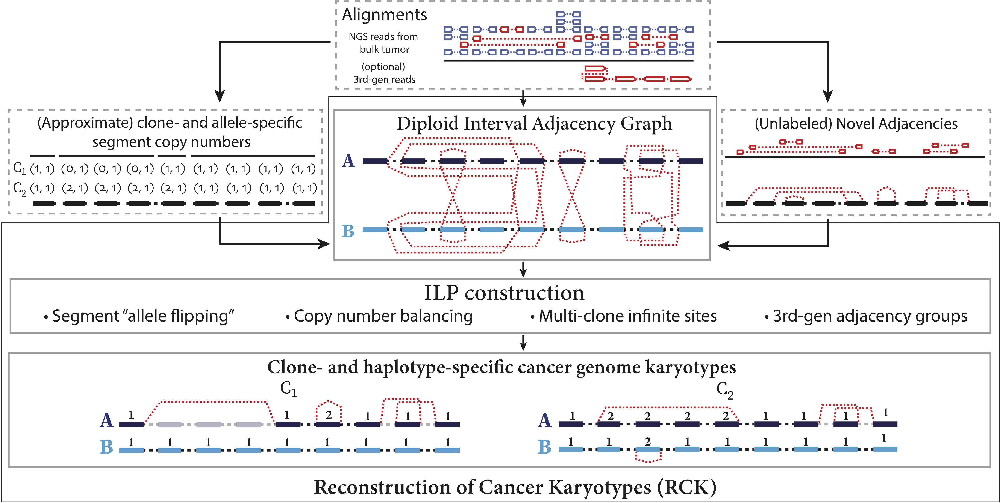

Reconstruction of clone- and haplotype-specific Cancer Karyotypes
==

**RCK** - is a method for **R**reconstruction of clone- and haplotype-specific **C**ancer **K**aryotypes from tumor mixtures, distributed both as a standalone software package and as a Python library  under the MIT licence.

RCK has been initially designed and developed by Sergey Aganezov in the group of prof. Ben Raphael at Princeton University.
Current development of RCK is continued by Sergey Aganezov in the group of prof. Michael Schatz at Johns Hopkins Univeristy.

The full description of the algorithm and its application on published cancer datasets are described in:

**biorxiv** link

Overview
-
Algorithm

**TODO description**
